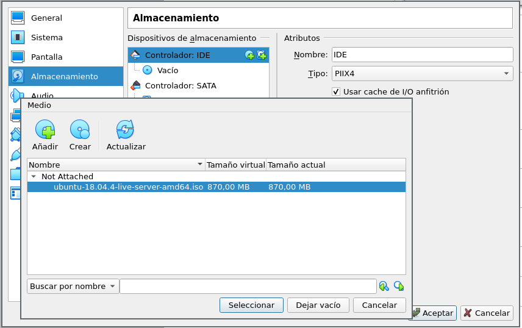
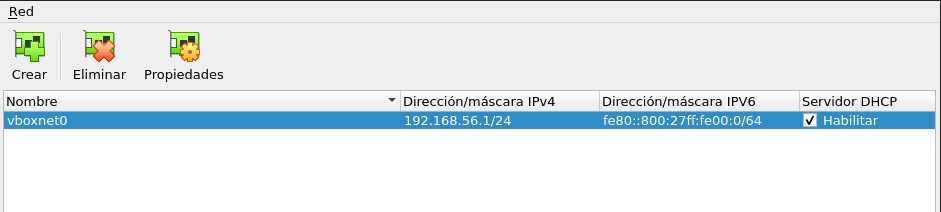
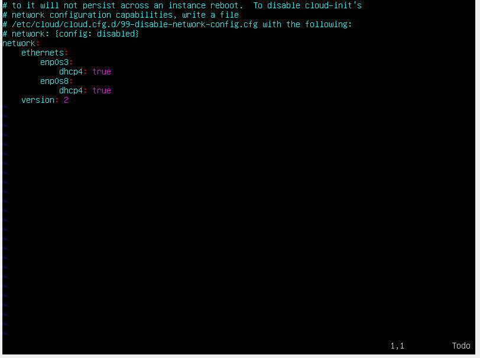
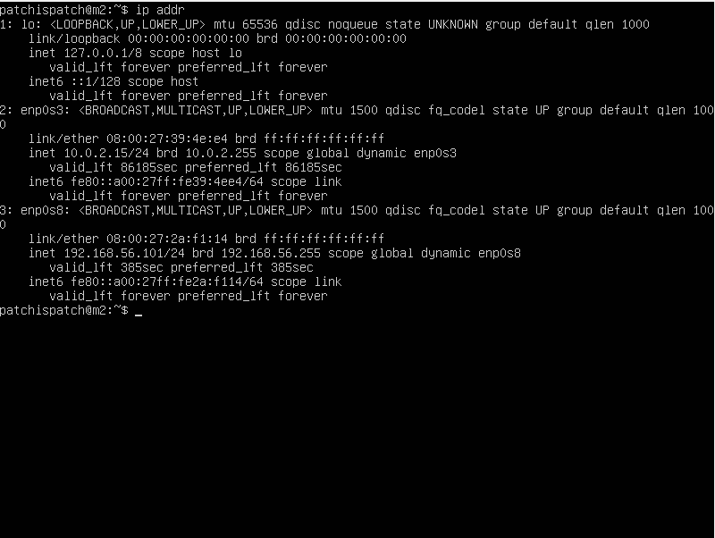
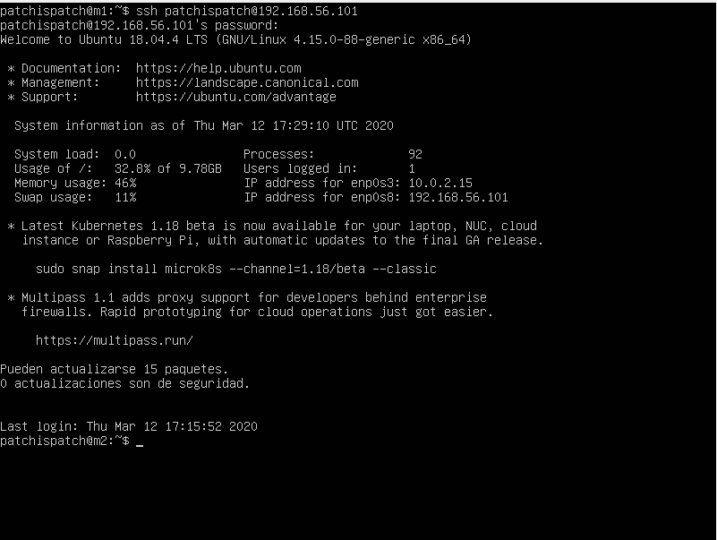
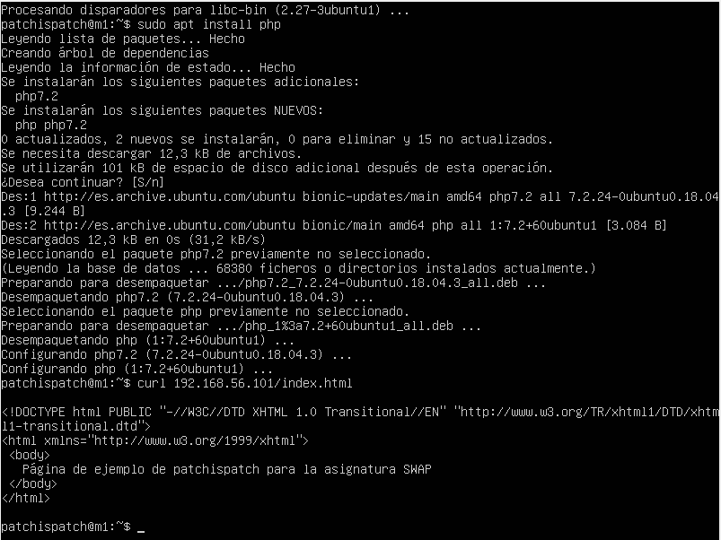

# Servidores Web de Altas Prestaciones

## Práctica 1

#### Autor: Juan Ocaña Valenzuela

En esta práctica se deben cumplir los siguientes objetivos:

- Instalar dos máquinas Ubuntu Server 18.04.
- Configurar un adaptador de red host-only para permitir comunicarlas entre sí.
- Conectarse vía ssh entre las dos máquinas.
- Instalar la pila LAMP en cada máquina y descargar un archivo html de una máquina a otra con curl.

### Instalar dos máquinas Ubuntu Server 18.04

Creamos dos máquinas, M1 y M2 en VirtualBox, asignando 512MB de RAM a cada una y 10GB de disco. Descargamos la imagen ISO de Ubuntu Server y, antes de ejecutar las máquinas, cargamos la imagen en el lector de discos virtual de cada una.

Iniciamos la máquina y tomamos la configuración base. La instalación procede, y una vez finaliza apagamos nuestras máquinas.

### Configurar un adaptador de red host-only para permitir comunicarlas entre sí

Debemos crear un adaptador de red sólo anfitrión y configurarlo en las máquinas.

Para crearlo, en VirtualBox accedemos a Archivo > Administrador de red de anfitrión, y pulsamos en "Crear". Aparecerá una nueva red llamada "vboxnet0".

Ahora debemos configurar este adaptador de red en las máquinas. Podemos atajar este problema de dos formas: configurar el adaptador desde VirtualBox en la máquina ANTES de realizar la instalación de Ubuntu, generando automáticamente el archivo de configuración de netplan; o configurarlo manualmente. En cualquiera de los dos casos, con esta configuración queda instalado el adaptador (el archivo de configuración se encuentra en `/etc/netplan`), y en caso de hacer la configuración manual se debe de ejecutar `netplan apply`.

### Conectarse vía ssh entre las dos máquinas 

Si no está instalado, debemos instalar en cada máquina `ssh-server`. Una vez instalado, podemos acceder a cada máquina con su dirección IP local, que podemos consultar con el comando `ip addr`. Podemos acceder tanto desde la otra máquina virtual como desde el host.

Consultando la dirección IP local de M2

Accediendo a M2 desde M1

### Instalar la pila LAMP en cada máquina y descargar un archivo html de una máquina a otra con curl

Para instalar la pila LAMP (Linux Apache MySQL Php) debemos instalar el servidor Apache2, un intérprete de php y el sistema gestor de bases de datos MySQL. Para ello ejecutamos lo siguiente: `sudo apt install apache2 mysql-server mysql-client php libapache2-mod-php php-mysql`

- `apache2` instala el servidor Apache
- `mysql-server` y `mysql-client` instalan el servidor y el cliente de MySQL, respectivamente
- `php` instala el intérprete de php
- `libapache2-mod-php` y `php-mysql` son módulos que permiten a php comunicarse con una base de datos MySQL

La instalación crea en la ruta de Apache (en el caso de Ubuntu es /var/www/html) un fichero index.html. no obstante, es meramente de ejemplo, y podemos crear el nuestro. Probamos a descargarlo desde una máquina remota ejecutando `curl <ip>/index.html`. Como se ve en una de las capturas anteriores, la dirección IP de la máquina M2 es 192.168.56.101.

