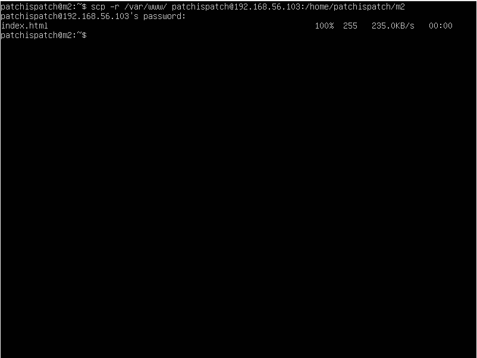
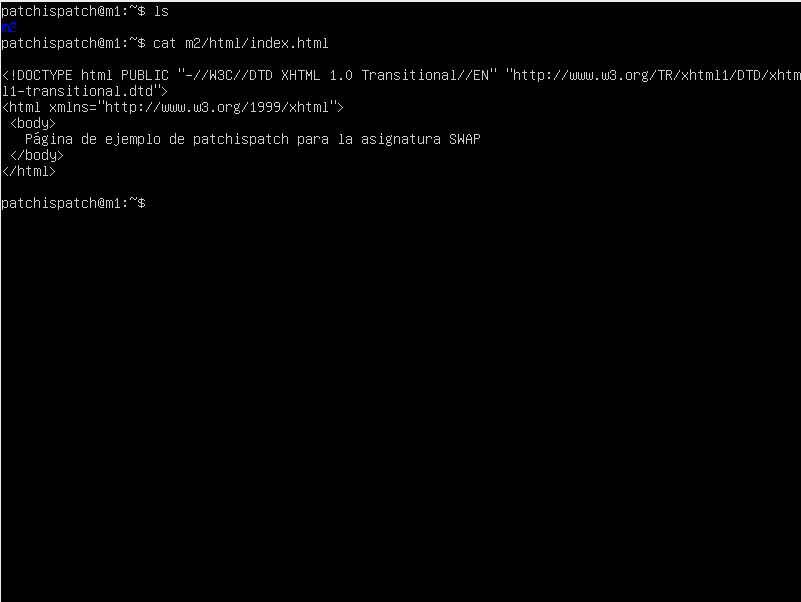
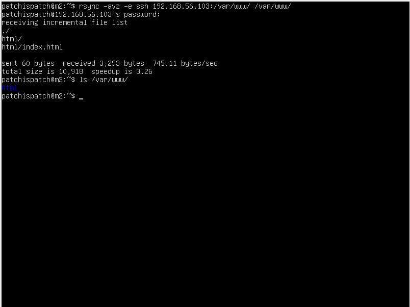
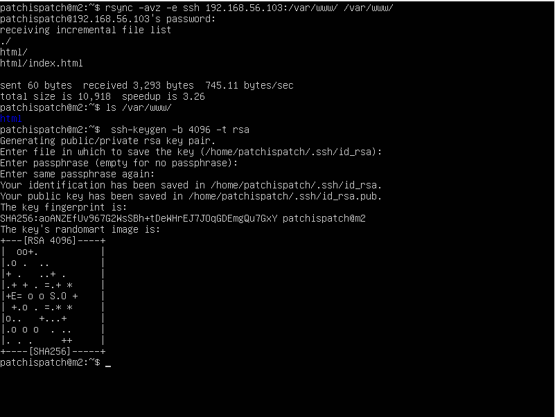
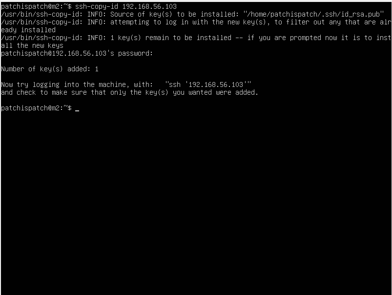
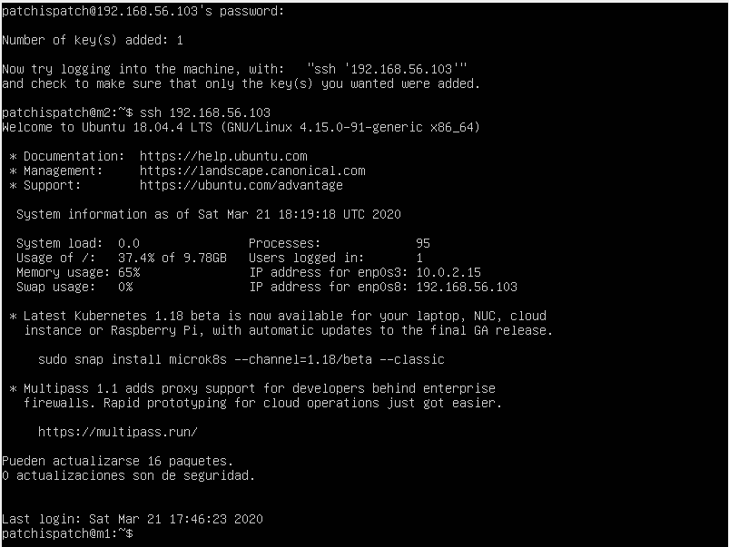
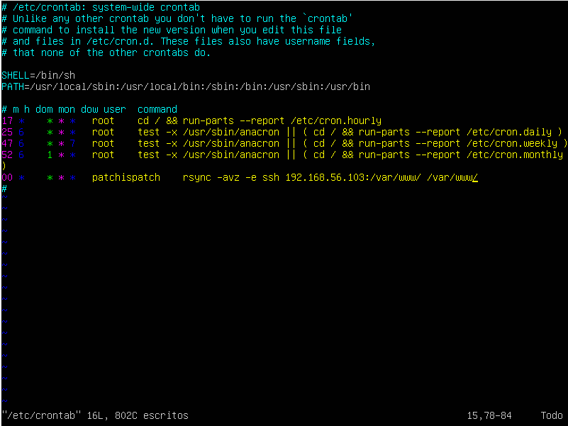

# Servidores Web de Altas Prestaciones

## Práctica 2

#### Autor: Juan Ocaña Valenzuela

En esta práctica se deben cumplir los siguientes objetivos:

- Probar el funcionamiento de la copia de archivos por ssh.
- Clonado de una carpeta entre las dos máquinas.
- Configuración de ssh para acceder sin que se solicite contraseña.
- Establecer una tarea en cron que se ejecute cada hora para mantener actualizado el contenido del directorio /var/www entre las dos máquinas.

### Probar el funcionamiento de la copia de archivos por ssh

Para probar el funcionamiento de la copia de archivos mediante ssh, copiaremos el contenido de la carpeta `/var/www` de M2 en M1 utilizando el comando `scp -r /var/www patchispatch@192.168.56.103:/home/patchispatch/m2`

Podemos ver el resultado en M1:

### Clonado de una carpeta entre dos máquinas

Para clonar una carpeta entre dos máquinas haremos uso de `rsync`, que ya viene instalada por defecto en Ubuntu Server 18.04.

Clonaremos la carpeta /var/www de M1 en M2, esta vez en su lugar correspondiente. Para ello ejecutaremos `rsync -avz -e ssh  192.168.56.103:/var/www/ /var/www/`, pero antes tendremos que asegurarnos de que la carpeta /var/www es propiedad del usuario sin privilegios. Si no lo es lo cambiaremos con `sudo chown -R patchispatch:patchispatch /var/www`.

Resultados de la ejecución de `rsync`.

### Configuración de ssh para acceder sin que se solicite contraseña

Para acceder entre máquinas sin solicitud de contraseña necesitamos hacerlo mediante un par de claves pública-privada. Desde la máquina secundaria (M2) generaremos las claves mediante `ssh-keygen -b 4096 -t rsa`.

No introducimos *passphrase* ya que no queremos que se nos solicite contraseña.

Ahora debemos copiar la clave pública de la máquina secundaria en las claves autorizadas de la principal. Lo haremos mediante `ssh-copy-id 192.168.56.102`

Le hacemos caso a la salida del programa e intentamos iniciar sesión:

Estamos dentro.

### Establecer una tarea en cron que se ejecute cada hora para mantener actualizado el contenido del directorio /var/www entre las dos máquinas

Para realizar este último paso utilizaremos el *daemon* del sistema `cron`, y definiremos en el archivo `etc/crontab` la tarea correspondiente.

Deseamos que se ejecute cada hora un clonado con rsync de /var/www/ de M1 en M2, por tanto, la línea que debemos añadir al archivo `crontab` de M2 es la siguiente:

	00 * * * * patchispatch rsync -avz -e ssh  192.168.56.103:/var/www/ /var/www/

El archivo crontab actualizado.