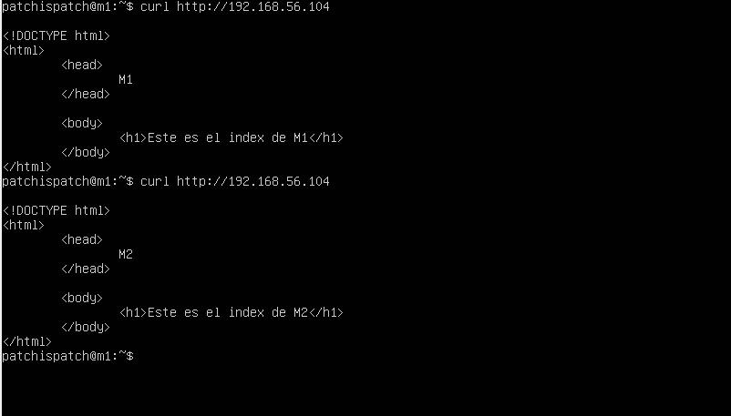

# Servidores Web de Altas Prestaciones

## Práctica 3

#### Autor: Juan Ocaña Valenzuela

En esta práctica se deben cumplir los siguientes objetivos:

- Configurar una máquina e instalar nginx como balanceador de carga.
- Configurar una máquina e instalar haproxy como balanceador de carga.
- Someter a la granja web a una alta carga, generada con la herramienta Apache Benchmark, teniendo primero nginx y después haproxy.

### Configurar una máquina e instalar nginx como balanceador de carga

Se ha creado una nueva máquina Ubuntu Server 10.04, M3, destinada a actuar como balanceador de carga entre nuestra granja web, compuesta de momento por M1 y M2.

En ella instalamos nginx con el comando `sudo apt install nginx`. Para configurarlo como balanceador de carga y no como servidor web debemos primero indicar el `upstream` del servidor, editando el archivo `/etc/nginx/conf.d/default.conf`. En nuestro caso no existe, así que lo creamos e indicamos la siguiente información:

La IP de M1 es `192.168.56.103` y la de M2 es `192.168.56.101`.

Para hacer efectivos los cambios, reiniciamos el servicio con `sudo systemctl nginx restart`. No obstante, al intentar acceder al servidor nginx a través de su IP, `192.168.56.104`, nos sigue sirviendo su contenido. Para solucionar esto debemos eliminar la línea que configura nginx como servidor web en `/etc/nginx/nginx.conf`.

Ahora mismo, si accedemos desde un navegador o descargamos el contenido del servidor M3 mediante `curl`, debería servirnos el contenido de M1 y M2 por turnos, ya que ambas máquinas tienen el mismo peso.

Podemos observarlo aquí:

### Configurar una máquina e instalar haproxy como balanceador de carga

Ya tenemos la máquina M3, por lo que instalamos haproxy con el comando `sudo apt install haproxy`.  Para que todo funcione correctamente, desactivamos nginx con `sudo systemctl stop nginx`.

Para configurar haproxy como un balanceador de carga debemos indicar nuestros servidores M1 y M2, así como el tipo de peticiones a balancear, en el archivo `/etc/haproxy/haproxy.cfg`:

Lanzamos haproxy con `sudo systemctl restart haproxy` y comprobamos el correcto balanceo de la carga:

### Someter a la granja web a una alta carga, generada con la herramienta Apache Benchmark, teniendo primero nginx y después haproxy

Para probar la resistencia a la carga, ejecutamos el comando `ab -n 10000 -c 10 http://192.168.56.104/index.html`, tanto con nginx como con haproxy. Haremos la petición esta vez desde el host, por variar.

#### Prueba con nginx:

#### Prueba con haproxy:

Podemos ver que todas las peticiones se han completado con ambos balanceadores, y que los tests se han ejecutado ligeramente más rápido utilizando nginx. 