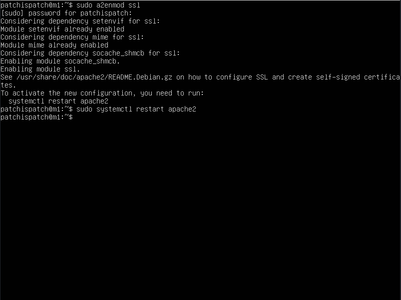
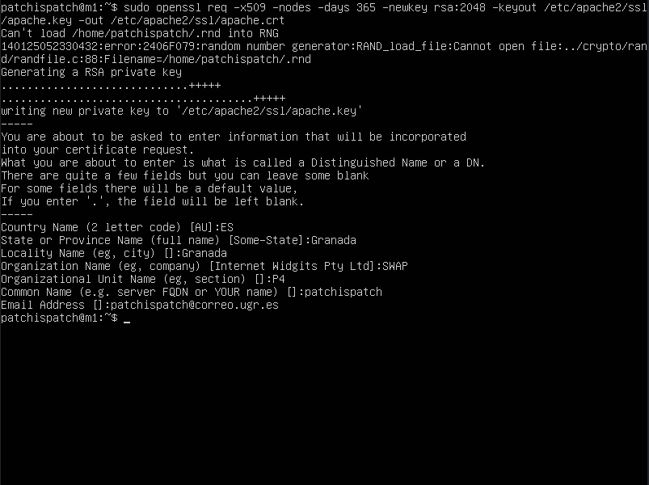
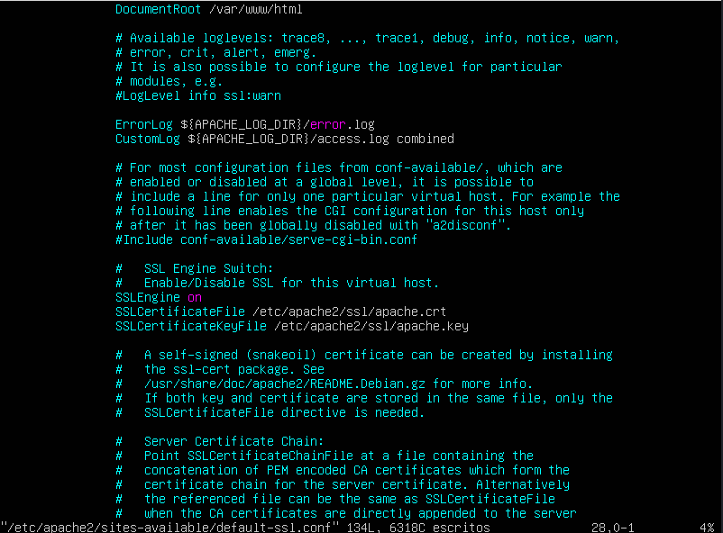
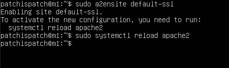
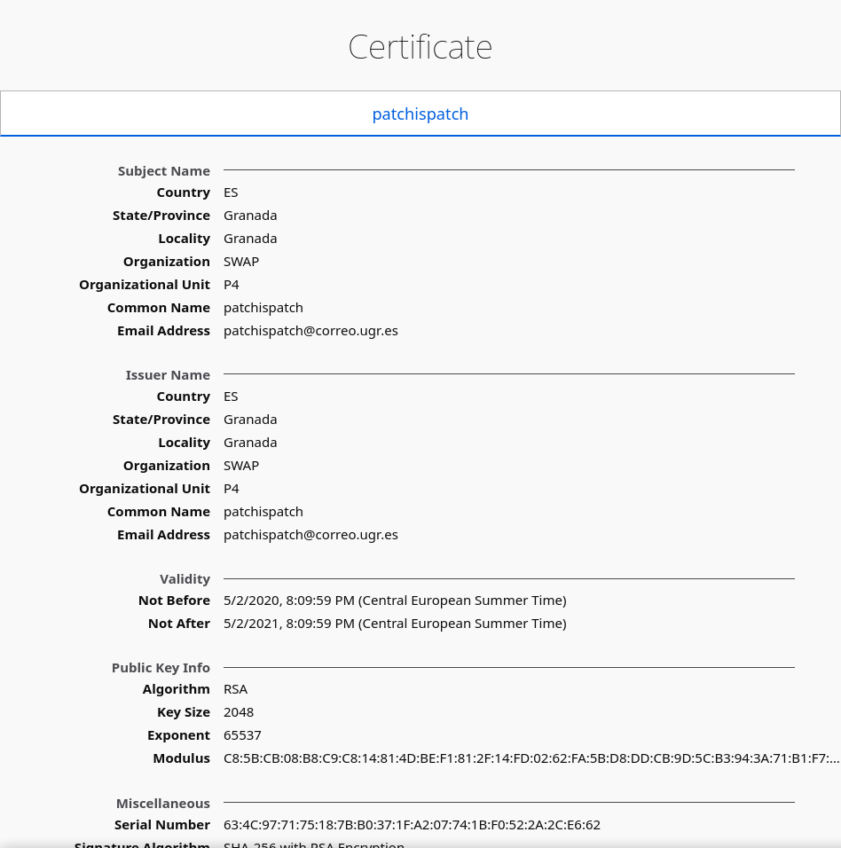
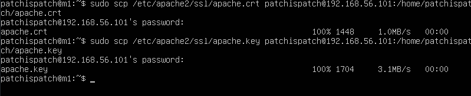
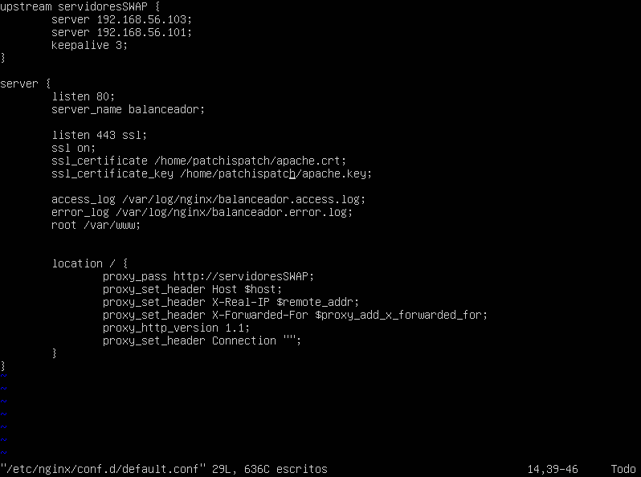
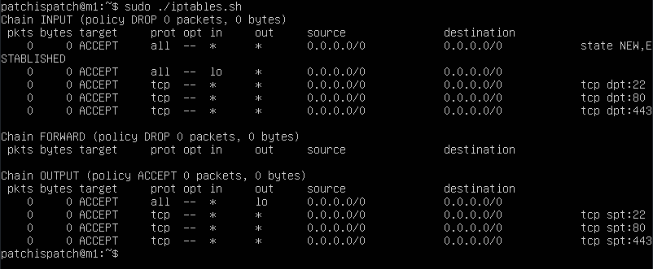

# Servidores Web de Altas Prestaciones

## Práctica 4

#### Autor: Juan Ocaña Valenzuela

En esta práctica se deben cumplir los siguientes objetivos obligatorios:

- Crear e instalar en la máquina M1 un certificado SSL autofirmado para configurar el acceso HTTPS al servidor. Se debe comprobar que el servidor acepta tanto el tráfico HTTP como el HTTPS.
- Configurar las reglas del cortafuegos con IPTABLES en uno de los servidores finales para asegurarlo, permitiendo el acceso por los puertos HTTP y HTTPS a dicho servidor. 

Además, se proponen los siguientes objetivos opcionales:

- Una vez configurada la máquina M1, copiar el certificado autofirmado al resto de máquinas servidoras y al balanceador, y configurar nginx adecuadamente para aceptar y balancear tráfico HTTP y HTTPS.
- Configurar M3 estableciendo las reglas de IPTABLES para que únicamente M3 acepte peticiones HTTP y HTTPS mientras que M1 y M2 no acepten nada a no ser que provenga de M3. Hacer que la configuración del cortafuegos se ejecute al arrancar el sistema.


### Crear e instalar en la máquina M1 un certificado SSL autofirmado para configurar el acceso HTTPS al servidor.

Vamos a configurar un certificado SSL autofirmado en M1. Para ello, activamos el módulo SSL de Apache con `sudo a2enmod ssl` y reiniciamos el servicio:




Ahora generamos los certificados. Para tenerlos a mano, los guardaremos en `/etc/apache2/ssl`, y utilizaremos openssl:




Ahora debemos añadir la ruta de los certificados en el archivo de configuración de SSL de Apache, activarlo y reiniciar el servicio para hacer efectivos los cambios:






Ahora vamos a acceder desde un navegador en el host y ver el certificado:




### Una vez configurada la máquina M1, copiar el certificado autofirmado al resto de máquinas servidoras y al balanceador, y configurar nginx adecuadamente para aceptar y balancear tráfico HTTP y HTTPS.

Para poder acceder a la granja web mediante el balanceador de carga, debemos copiar el certificado al resto de máquinas.

En M2, puesto que también se trata de un servidor Apache, la configuración es la misma; tan solo tenemos que copiar el certificado mediante, por ejemplo, scp.



En M2, actualizamos la configuración de Apache para que sea idéntica a la de M1. Sin embargo, en M3 debemos configurar Nginx, no Apache, añadiendo un nuevo `server` con los siguientes datos al archivo `/etc/nginx/conf.d/default.conf`:




Ahora podemos acceder mediante HTTPS a la IP del balanceador, y nos mostrará correctamente (previo aviso de certificado autofirmado) la información correspondiente.

### Configurar las reglas del cortafuegos con IPTABLES en uno de los servidores finales para asegurarlo, permitiendo el acceso por los puertos HTTP y HTTPS a dicho servidor. 

Vamos a configurar IPTABLES en las máquinas M1 y M2. Para ello, utilizaremos el siguiente script:

```
#!/bin/sh

# (1) Eliminar todas las reglas (configuración limpia)
iptables -F
iptables -X
iptables -Z
iptables -t nat -F 

# (2) Política por defecto: denegar todo el tráfico entrante
iptables -P INPUT DROP
iptables -P OUTPUT ACCEPT
iptables -P FORWARD DROP
iptables -A INPUT -m state --state NEW,ESTABLISHED -j ACCEPT

# (3) Permitir cualquier acceso desde localhost (interface lo)
iptables -A INPUT  -i lo -j ACCEPT
iptables -A OUTPUT -o lo -j ACCEPT

# (4) Abrir el puerto 22 para permitir el acceso por SSH
iptables -A INPUT  -p tcp --dport 22 -j ACCEPT
iptables -A OUTPUT-p tcp --sport 22 -j ACCEPT

# (5) Permitir el tráfico por el puerto 80 (HTTP)
iptables -A INPUT -p tcp --dport 80 -j ACCEPT
iptables -A OUTPUT -p tcp --sport 80 -j ACCEPT

# (6) Permitir el tráfico por el puerto 443 (HTTPS)
iptables -A INPUT -p tcp --dport443 -j ACCEPT
iptables -A OUTPUT -p tcp --sport 443 -j ACCEPT

iptables -L -n -v
```


Al ejecutar recibimos la siguiente salida




### Configurar M3 estableciendo las reglas de IPTABLES para que únicamente M3 acepte peticiones HTTP y HTTPS mientras que M1 y M2 no acepten nada a no ser que provenga de M3. Hacer que la configuración del cortafuegos se ejecute al arrancar el sistema.

Para permitir que únicamente M3 se comunique con M1 y M2 a través de los puertos 80 y 443 (HTTP y HTTPS), debemos modificar nuestras reglas de iptables de la siguiente forma:

```
# IP permitida
IP=192.168.56.104

# HTTP
iptables -A INPUT -p tcp -s $IP --dport 80 -j ACCEPT
iptables -A OUTPUT -p tcp -s $IP --sport 80 -j ACCEPT

# (6) Permitir el tráfico por el puerto 443 (HTTPS)
iptables -A INPUT -p tcp -s $IP --dport443 -j ACCEPT
iptables -A OUTPUT -p tcp -s $IP --sport 443 -j ACCEPT
```


Para que nuestro script se ejecute al inicio debemos hacer lo siguiente:

1. Mover nuestro script a /etc/init.d/
2. `sudo chmod -x /etc/init.d/iptables.sh`
3. `sudo chown root.root /etc/init.d/iptables.sh`
4. `sudo update-rc.d test.sh defaults`


