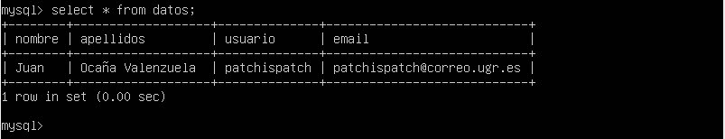

# Servidores Web de Altas Prestaciones

## Práctica 5

#### Autor: Juan Ocaña Valenzuela

En esta práctica se deben cumplir los siguientes objetivos obligatorios:

- Crear una BD con al menos una tabla y algunos datos
- Realizar la copia de seguridad de la BD completa usando mysqldump en la áquina principal y copiar el archivo de copia de seguridad a la máquina secundaria
- Restaurar dicha copia de seguridad en la segunda máquina (clonado manual de la BD), de forma que en ambas máquinas esté esa BD de forma idéntica
- Realizar la configuración maestro-esclavo de los servidores MySQL para que la replicación de datos se realice automáticamente
- [Opcional] Realizar la configuración maestro-maestro entre las dos máquinas de bases de datos

### Crear una BD con al menos una tabla y algunos datos

Vamos a crear una base de datos en M1 llamada estudiante, con el usuario root. Para ello, abrimos el intérprete de MySQL en la terminal con `sudo mysql -u root -p`, e introducimos la contraseña.

Para crear la base de datos, basta con ejecutar `create database estudiante;`, y para utilizarla escribimos `use estudiante;`

Por último, para crear una tabla *datos*, basta con ejecutar la sentencia SQL `CREATE TABLE datos (nombre varchar(100), apellidos varchar(100), usuario varchar(100), email varchar(100));`

Podemos consultar la estructura de la tabla con `describe datos`, e introducir una tupla con:

`INSERT INTO datos (nombre, apellidos, usuario, email) VALUES ('Juan', 'Ocaña Valenzuela', 'patchispatch', 'patchispatch@correo.ugr.es');`

Para ver que lo hemos hecho correctamente, ejecutamos la consulta `SELECT * FROM datos;`

