# Servidores Web de Altas Prestaciones

## Práctica 5

#### Autor: Juan Ocaña Valenzuela

En esta práctica se deben cumplir los siguientes objetivos obligatorios:

- Crear una BD con al menos una tabla y algunos datos
- Realizar la copia de seguridad de la BD completa usando mysqldump en la máquina principal y copiar el archivo de copia de seguridad a la máquina secundaria
- Restaurar dicha copia de seguridad en la segunda máquina (clonado manual de la BD), de forma que en ambas máquinas esté esa BD de forma idéntica
- Realizar la configuración maestro-esclavo de los servidores MySQL para que la replicación de datos se realice automáticamente
- [Opcional] Realizar la configuración maestro-maestro entre las dos máquinas de bases de datos


### Crear una BD con al menos una tabla y algunos datos

Vamos a crear una base de datos en M1 llamada estudiante, con el usuario root. Para ello, abrimos el intérprete de MySQL en la terminal con `sudo mysql -u root -p`, e introducimos la contraseña.

Para crear la base de datos, basta con ejecutar `create database estudiante;`, y para utilizarla escribimos `use estudiante;`

Por último, para crear una tabla *datos*, basta con ejecutar la sentencia SQL `CREATE TABLE datos (nombre varchar(100), apellidos varchar(100), usuario varchar(100), email varchar(100));`

Podemos consultar la estructura de la tabla con `describe datos`, e introducir una tupla con:

`INSERT INTO datos (nombre, apellidos, usuario, email) VALUES ('Juan', 'Ocaña Valenzuela', 'patchispatch', 'patchispatch@correo.ugr.es');`

Para ver que lo hemos hecho correctamente, ejecutamos la consulta `SELECT * FROM datos;`


### Realizar la copia de seguridad de la BD completa usando mysqldump en la máquina principal y copiar el archivo de copia de seguridad a la máquina secundaria

Para realizar la copia a mano debemos usar `mysqldump` a un archivo. Como se describe en el guión de la práctica, realizaremos un volcado en el archivo `estudiante.sql`. Antes debemos bloquear las tablas, así que abrimos el intérprete de MySQL con el usuario root y ejecutamos `FLUSH TABLES WITH READ LOCK`:

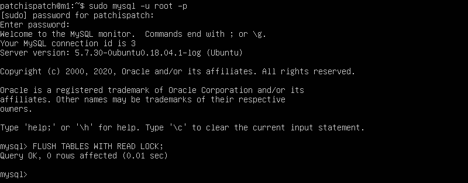


Ahora realizamos el volcado con la orden `sudo mysqldump estudiante -u root -p > /tmp/estudiante.sql`

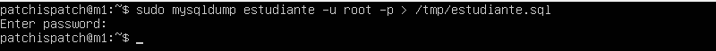 


Podemos desbloquear las tablas dentro del intérprete MySQL con `UNLOCK TABLES`.

Vamos a copiar el archivo temporal a la máquina M2 mediante scp:

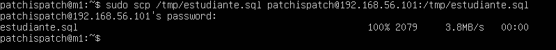


### Restaurar dicha copia de seguridad en la segunda máquina (clonado manual de la BD), de forma que en ambas máquinas esté esa BD de forma idéntica

Ahora desde M2 debemos reestablecer la copia de seguridad, pero antes debemos crear la base de datos, ya que el archivo no contiene la información para hacerlo por sí mismo. En M2 creamos la base de datos estudiante con `create database estudiante`, y reestablecemos la copia de seguridad con `sudo mysql -u root -p estudiante < /tmp/estudiante.sql`.

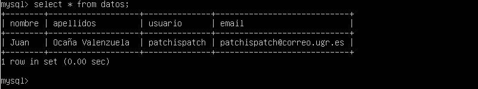


### Realizar la configuración maestro-esclavo de los servidores MySQL para que la replicación de datos se realice automáticamente

Para realizar la configuración maestro-esclavo, debemos modificar el archvo de configuración de MySQL.

#### En M1

Accedemos al archivo de configuración `/etc/mysql/mysql.conf.d/mysqld.cnf` y comentamos las líneas `bind-address 127.0.0.1` , `log_error = /var/log/mysql/error.log` y `log_bin = /var/log/mysql/bin.log`.

Además, debemos descomentar la línea `server-id = 1`.

Una vez realizados los cambios, guardamos y reiniciamos el servicio.

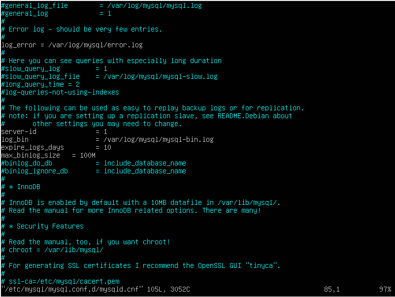


Ahora debemos entrar en MySQL y crear un usuario esclavo con contraseña "esclavo", y otorgarle permisos de replicación:

```
sudo mysql -u root -p
CREATE USER esclavo IDENTIFIED BY 'esclavo';
GRANT REPLICATION SLAVE ON *.* TO 'esclavo'@'%' IDENTIFIED BY 'esclavo';
FLUSH PRIVILEGES;
FLUSH TABLES;
FLUSH TABLES WITH READ LOCK;
```

Para comprobar que todo ha ido bien, ejecutamos `SHOW MASTER STATUS`:

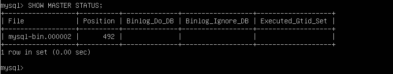


#### En M2

Debemos modificar el mismo archivo de configuración, esta vez poniendo `server-id = 2`. Guardamos y reiniciamos el servicio.

En MySQL debemos ejecutar la siguiente sentencia:

```
CHANGE MASTER TO MASTER_HOST='192.168.56.103',
MASTER_USER='esclavo', MASTER_PASSWORD='esclavo',
MASTER_LOG_FILE='mysql-bin.000001', MASTER_LOG_POS=980,
MASTER_PORT=3306;
```


#### Resultados

Para arrancar el esclavo ejecutamos `START SLAVE`, y la configuración está lista. Ahora si cambiamos algo en M1 se replicará automáticamente en M2.

En M1:

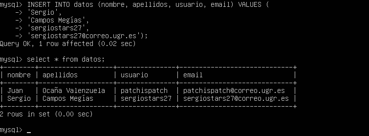


En M2:

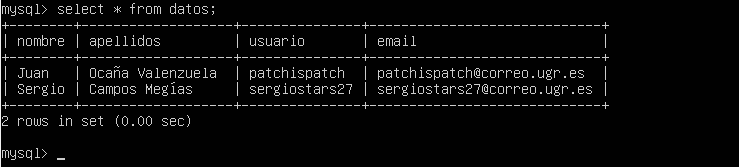


### [Opcional] Realizar la configuración maestro-maestro entre las dos máquinas de bases de datos

Para realizar la configuración maestro-maestro entre las dos máquinas, simplemente debemos crear el usuario replicador y establecer el maestro en M1, tal y como hemos hecho hasta ahora. Como ya tenemos los archivos de configuración modificados y puestos a punto, no necesitamos abrirlos de nuevo.

#### En M2

Debemos crear el usuario replicador al que anteriormente hemos llamado *esclavo*.

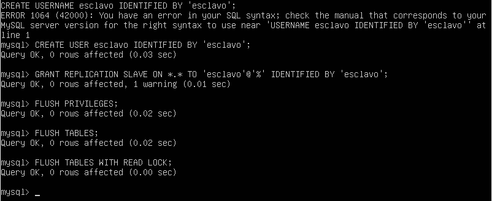


#### En M1

Ejecutamos la misma sentencia que antes, cambiando la IP y los datos de log:

```
CHANGE MASTER TO MASTER_HOST='192.168.56.101',
MASTER_USER='esclavo', MASTER_PASSWORD='esclavo',
MASTER_LOG_FILE='mysql-bin.000002', MASTER_LOG_POS=2381,
MASTER_PORT=3306;
```

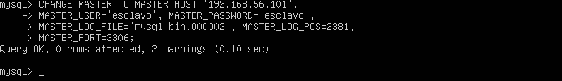


Por último, debemos iniciar el esclavo con `START SLAVE;`

#### Resultados

En M2 ejecutamos la siguiente orden *INSERT*:

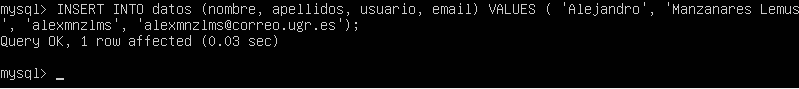


En M1 realizamos la siguiente consulta:

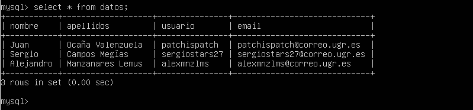


Y ya tenemos nuestra configuración maestro-maestro.