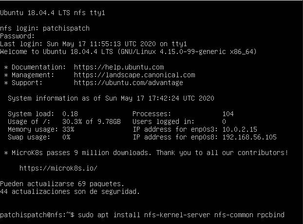

# Servidores Web de Altas Prestaciones

## Práctica 6

#### Autor: Juan Ocaña Valenzuela

En esta práctica se deben cumplir los siguientes objetivos obligatorios:

- Configurar una máquina como servidor de disco NFS y exportar una carpeta a los clientes
- Montar en las máquinas cliente la carpeta exportada por el servidor
- Comprobar que la información que se escribe en una máquina en dicha carpeta se ve actualizada en el resto de carpetas que comparten ese espacio
- Añadir configuración de seguridad al servidor NFS asegurando los accesos


### Configurar una máquina como servidor de disco NFS y exportar una carpeta a los clientes

Configuraremos una máquina nueva de Ubuntu 18.04 llamada NFS como servidor de disco NFS, comprobando que puede conectarse con el resto de máquinas. Le daremos la IP estática `192.168.56.105`.

Una vez finalizada la instalación, instalamos los paquetes `nfs-kernel-server`, `nfs-common` y `rpcbind`.




Creamos la carpeta de datos `/datos/compartido`, y cambiamos el propietario con `sudo chown nobody:nogroup /datos/compartido`. Por último, le damos todos los permisos de forma recursiva con `sudo chmod -R 777 /datos/compartido`.


Para permitir que accedan las máquinas M1 (`192.168.56.103`) y M2 (`192.168.56.101`) a la carpeta compartida, debemos editar el archivo de configuración `/etc/exports` como sigue a continuación:


Finalmente, reiniciamos el servicio y comprobamos que queda activo. Pasamos a realizar la configuración en las máquinas cliente.


### Montar en las máquinas cliente la carpeta exportada por el servidor

En las máquinas cliente debemos instalar los paquetes `nfs-common` y `rpcbind`. Una vez hecho, crear una carpeta con todos los permisos para montar los datos:


Montamos la carpeta remota sobre el directorio con la orden `sudo mount 192.168.56.105:/datos/compartido datos`:


Para comprobar que funciona, vamos a crear un archivo en M1 y veremos si está disponible en M2 y NFS:


### Añadir configuración de seguridad al servidor NFS asegurando los accesos

Partimos de una política por defecto de denegación implícita:

```
iptables -P INPUT DROP
iptables -P OUTPUT ACCEPT
iptables -P FORWARD DROP
iptables -A INPUT -m state --state ESTABLISHED,RELATED -j ACCEPT
```


Antes de configurar los servicios **mountd** y **nlockmgr**, debemos fijar sus puertos, ya que utilizan puertos dinámicos. 

#### mountd

Añadimos `-p 2000` para que utilice el puerto 2000 tanto para TCP como UDP:


#### nlockmgr

Para configurar nlockmgr debemos crear un archivo de configuración para que systemd se haga cargo de la configuración, ya que es un módulo del kernel. Creamos el archivo `/etc/sysctl.d/swap-nfs-ports.conf`, e introducimos lo siguiente:

```
fs.nfs.nlm_tcpport = 2001
fs.nfs.nlm_udpport = 2002
```

En este caso necesitamos un puerto para TCP y otro para UDP.


Lanzamos el archivo de configuración con `sudo sysctl --system/etc/init.d/nfs-kernel-server restart`


Nuestro script de IPTABLES quedaría así:


Ejecutamos el script: 


Y comprobamos que todo funciona añadiendo un nuevo archivo desde M2 esta vez:


