# Servidores Web de Altas Prestaciones

## Trabajo sobre OpenVPN aplicado a una granja web

### Antes de instalar

Inicialmente se iba a realizar la instalación en una Raspberry Pi 3 B+, pero debido a las circunstancias excepcionales es imposible acceder a ella en estos momentos. Si nembargo, el procedimiento es el mismo y no debería haber mayor problema en replicarlo en Raspbian u otros sistemas, salvo ligeras diferencias en el gestor de paquetes y la localización de algunos archivos de configuración.


### Preparación

#### Servidor VPN

Para el servidor VPN, utilizaremos una máquina virtual con Ubuntu 18.04 LTS, con 10GB de disco y 1024MB de RAM. Para asegurar que dispone de una IP única, debemos configurar el adaptador sólo-anfitrión de VirtualBox.

En el instalador de Ubuntu proporcionamos los siguientes datos:

- Nombre del servidor: vpn
- Nombre de usuario: patchispatch
- Contraseña: Swap1234

Es necesario que el usuario creado tenga privilegios `sudo`, algo que el instalador de Ubuntu hace por nosotros.

Además, le proporcionaremos una IP estática, en este caso `192.168.56.106` mediante la configuración de netplan:

```yaml
network:
	ethernets:
		enp0s3:
			dhcp4: true
		enp0s8:
			addresses:
				- 192.168.56.106/24
	version: 2
```

Una vez modificada la configuración, aplicamos los cambios con `sudo netplan apply`. Ya tenemos nuestra máquina lista para conectarse con el resto de la red local.


#### Entidad certificadora

Aunque es posible utilizar la misma máquina servidora como entidad certificadora, la documentación oficial de OpenVPN recomienda que se utilice una máquina dedicada de forma exclusiva a importar y firmar certificados.

Para esta máquina certificadora, utilizaremos también Ubuntu 18.04 LTS, con 10GB de disco y 512MB de RAM. De nuevo, configuramos el adaptador sólo-anfitrión de VirtualBox para permitir que nuestra máquina disponga de una IP única para comunicarse con otras máquinas.

En el instalador de Ubuntu proporcionamos los siguientes datos:

- Nombre del servidor: ca
- Nombre de usuario: patchispatch
- Contraseña: Swap1234

De nuevo, necesitamos un usuario con privilegios `sudo`, aunque ya hemos visto que Ubuntu se encarga de ello.

La entidad certificadora tendrá la IP estática `192.168.56.107`:

```yaml
network:
	ethernets:
		enp0s3:
			dhcp4: true
		enp0s8:
			addresses:
				- 192.168.56.107/24
	version: 2
```


#### Cortafuegos básico

Para establecer seguridad tanto en el servidor VPN como en la entidad certificadora, vamos a establecer un firewall básico. En lugar de utilizar iptables como se ha visto en la asignatura, usaremos la herramienta **ufw**, dada su facilidad de uso.

Partiremos de una configuración que permita únicamente el acceso mediante SSH en ambas máquinas.

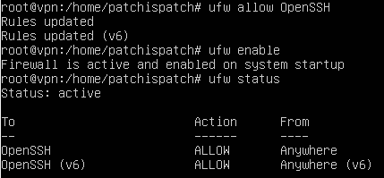


### Instalación

En primer lugar, instalamos en nuestra máquina **vpn** el servidor OpenVPN con `sudo apt install openvpn`. 

Para configurar la entidad certificadora, debemos descargar mediante *wget* el paquete `EasyRSA` con la siguiente orden, **tanto en la máquina *vpn* como en la máquina *ca***:

```
wget -P ~/ https://github.com/OpenVPN/easy-rsa/releases/download/v3.0.7/EasyRSA-3.0.7.tgz
```

Y extraemos con `tar xvf`. 


### Configuración de la entidad certificadora

Para configurar la entidad certificadora, en nuestra máquina **CA** entramos en la carpeta `EasyRSA-3.0.7` que acabamos de descomprimir, y copiamos el archivo `vars.example` como `vars` para editarlo. 

Debemos especificar los datos de nuestra entidad certificadora, descomentando los valores del archivo y fijando los que queramos. Los datos de nuestra entidad certificadora serán los siguientes:

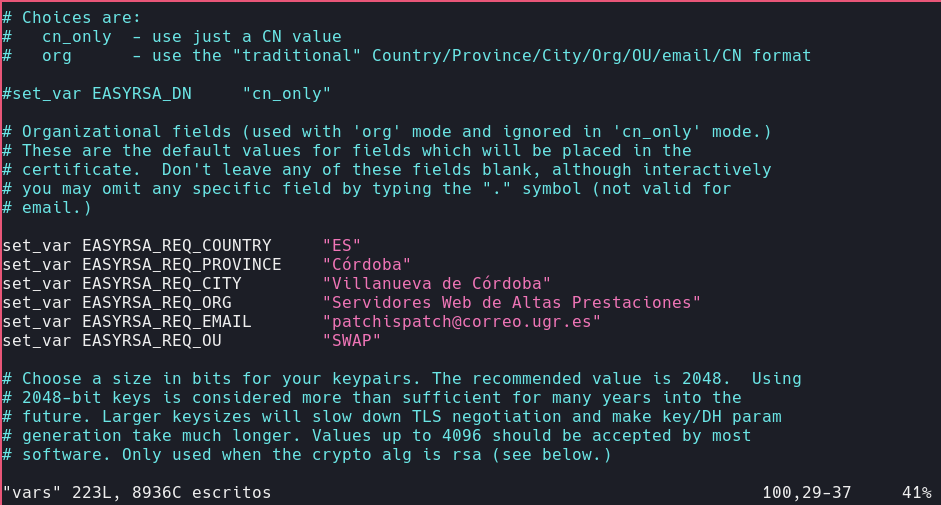


Para gestionar el servicio de RSA, debemos ejecutar el script `easyrsa` con una serie de opciones. Primero lo ejecutamos con la opción `init-pki`, para crear la infraestructura de claves públicas. Esto lo realizamos en el servidor **CA**, no en el servidor VPN.

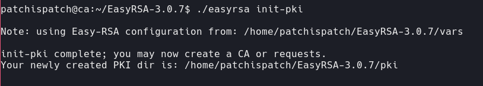


Para crear el certificado, ejecutamos de nuevo el script `easyrsa`, esta vez con la opción `build-ca`. Esto generará los archivos `ca.crt` y `ca.key`. Como vamos a generar el certificado sin contraseña esta vez, debemos indicar también la opción `nopass`:

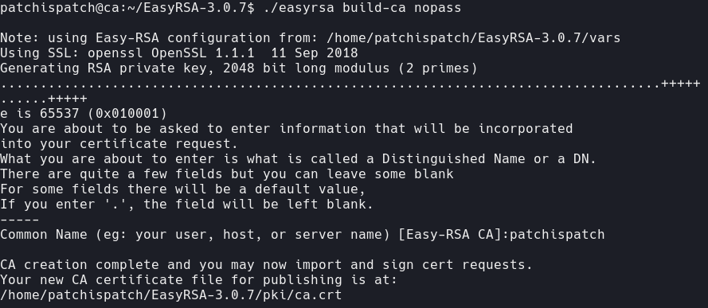


Con estos pasos, la entidad certificadora está lista para firmar certificados.


### Generación y firmado del certificado del servidor

Para generar un certificado para nuestro servidor OpenVPN, debemos abrir la carpeta EasyRSA-3.0.7 en nuestra máquina, e inicializar la infraestructura de claves con `./easyrsa init-pki`, como hicimos con nuestra entidad certificadora.

Una vez realizado, debemos generar una solicitud de certificado con `./easyrsa gen-req`. Identificaremos el servidor VPN como `server`, e incluimos la opción `nopass` para que no nos solicite contraseña para las claves. La instrucción completa quedaría como `./easyrsa gen-req server nopass`:

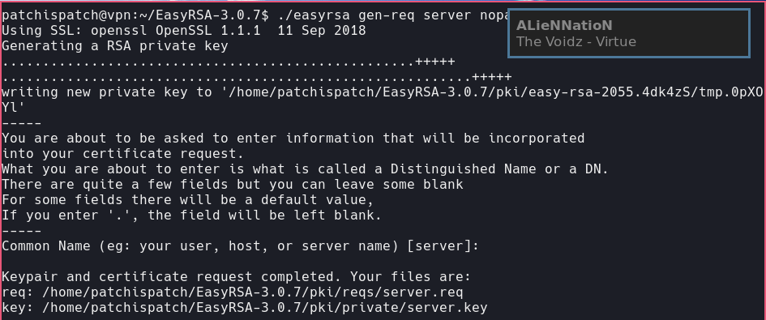


Esto nos generará una clave privada y el certificado del servidor, llamado `server.req`. Debemos copiar la clave privada a nuestra carpeta `/etc/openvpn`. Además, debemos enviar el certificado a nuestro servidor CA. Lo haremos mediante `scp`:

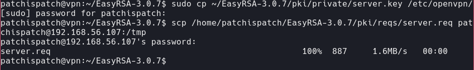


En la máquina CA debemos firmar el certificado con el polivalente script `easyrsa` . Para importarlo, ejecutamos `./easyreq import-req /tmp/server.req server`, y para firmarlo utilizamos la opción `sign-req`:

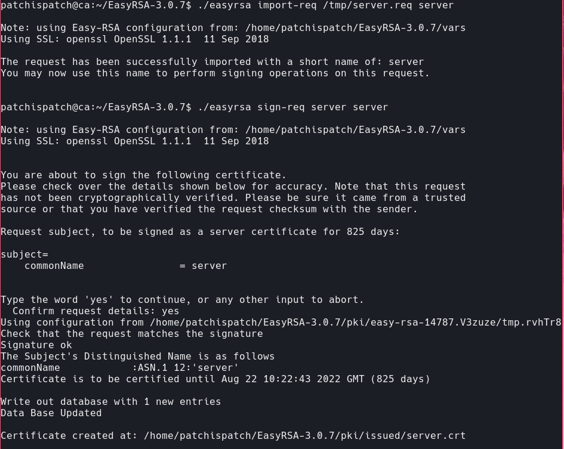


Ya hemos firmado nuestro certificado, y debemos enviarlo al servidor VPN, de nuevo, utilizando `scp`. Además, transferimos el certificado de la propia entidad:

```
scp pki/issued/server.crt patchispatch@192.168.56.106:/tmp
scp pki/ca.crt patchispatch@192.168.56.106:/tmp
```


Desde la máquina VPN, copiamos los dos certificados a `/etc/openvpn`.

Ahora necesitamos claves de encriptado fuertes, para garantizar la integridad de nuestro servidor VPN. Desde la carpeta EasyRSA-3.0.7 ejecutamos `./easyrsa gen-dh`, lo que nos generará una clave de cifrado Diffie-Hellman.


Una vez termine el proceso, que en nuestro caso ha tardado alrededor de un minuto, generaremos una firma HMAC con `openvpn` para fortalecer la seguridad de la verificación aún más:

```
openvpn --genkey --secret ta.key
```


Y cuando termine, copiamos las dos claves a nuestro directorio `/etc/openvpn`

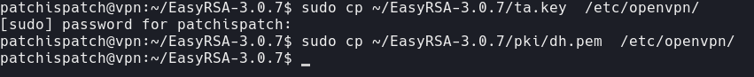


Ahora disponemos de todas las claves y certificados necesarios para que las máquinas cliente accedan al servidor OpenVPN:

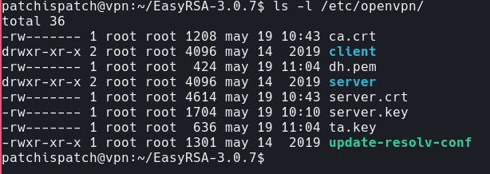


> Para minimizar el riesgo de que accedan a nuestra entidad certificadora, cerramos la sesión. Si la hubiésemos configurado en nuestro servidor vpn, siempre estaría disponible para que un atacante accediese y pudiese firmar certificados ilícitos.

### Generación del certificado y las claves del cliente

La generación y firmado de claves se va a realizar desde el servidor, ya que para este ejemplo es más rápido y además permite ser automatizada.

Para guardar correctamente los certificados, crearemos la carpeta `~/client-configs/keys` en el servidor VPN, y otorgaremos permisos `700` para asegurarla.


Para generar el certificado del primer cliente, al que llamaremos `client1`, debemos volver al directorio `EasyRSA-3.0.7`, y ejecutar de nuevo el script con la opción `gen-req`. También podemos indicar `nopass` si no queremos contraseña:

```
./easyrsa gen-req client1 nopass
```

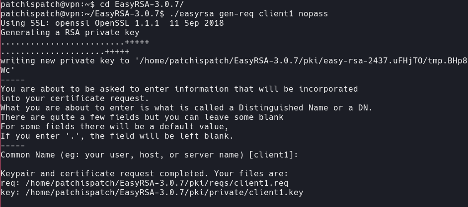

Copiamos la clave generada a la carpeta creada anteriormente y transferimos el certificado a nuestra máquina CA:

```shell
cp pki/private/client1.key ~/client-configs/keys/
scp pki/reqs/client1.req patchispatch@192.168.56.107:/tmp
```


En nuestra máquina CA, importamos el certificado como hemos hecho anteriormente, con `easyrsa import-req`. Una vez hecho esto, procedemos a firmar el certificado, esta vez asegurándonos de que lo hacemos para un cliente:

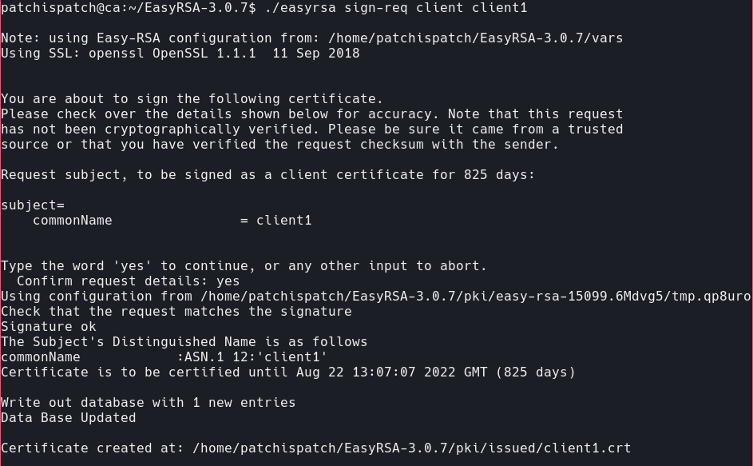

Enviamos el certificado firmado al servidor, y una vez allí, lo copiamos a `~/client-configs/keys/`. También debemos copiar los archivos `ta.key` y `ca.crt` que hemos generado anteriormente.

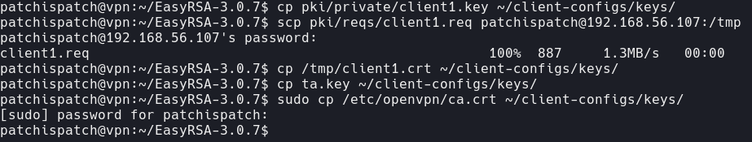


Utilizaremos los archivos más adelante. Ahora vamos a configurar el servicio OpenVPN.


### Configuración del servicio OpenVPN

#### Configuración básica

Para comenzar a configurar el servicio, copiamos el archivo de configuración de ejemplo:


En el archivo de configuración, buscamos la directiva `tls-auth`. Si la línea en la que se encuentra estuviese comentada, se ha de descomentar. Por lo general, no está comentada por defecto. También debemos descomentar la directiva `cipher` si no lo estuviera.

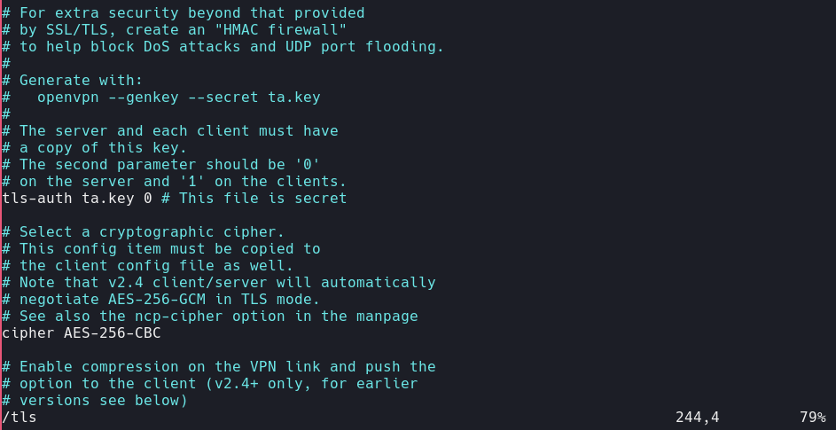


Además, debemos añadir debajo de `cipher` la directiva `auth SHA256`.

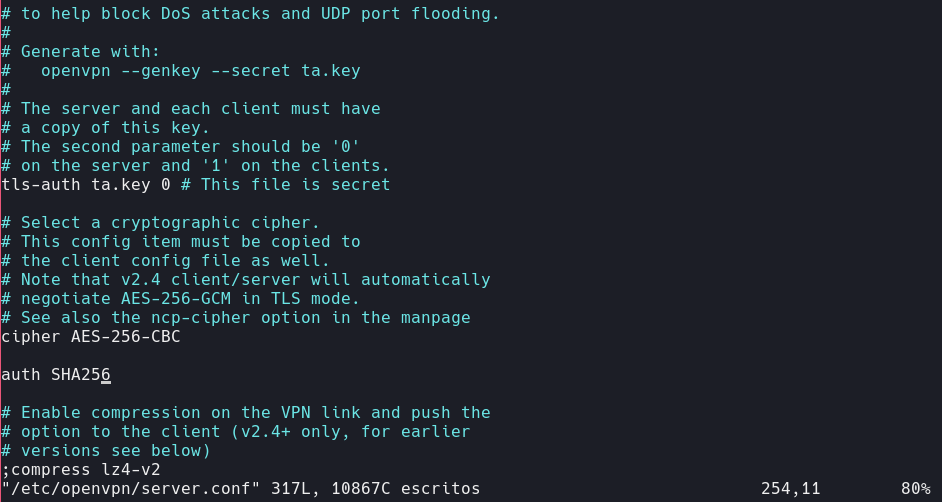


Debemos buscar también la directiva `dh`, y cambiar el nombre de archivo para que corresponda con el que generamos anteriormente. En nuestro caso, debemos cambiar `dh2048.pem` por `dh.pem`.

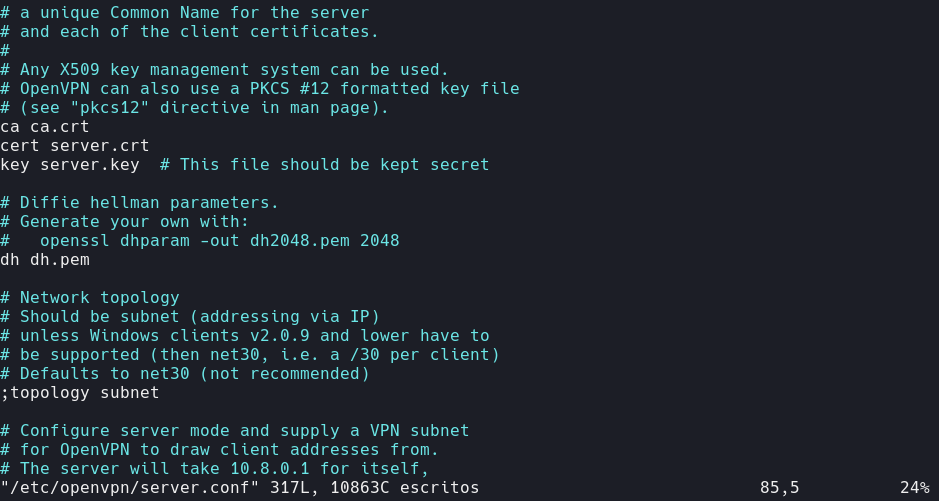


Y finalmente descomentamos las líneas de usuario y grupo, ya que estamos utilizando un sistema distinto de Windows.

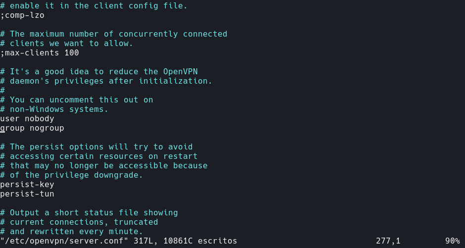


#### Configuración opcional

A continuación se van a realizar cambios opcionales en la configuración, detallados en la guía seguida para la instalación. Para las distintas aplicaciones que proponemos sobre cómo utilizar esta tecnología en una granja web serán de mucha utilidad.

En concreto, vamos a **enviar la configuración de DNS a los clientes para que todo el tráfico se redirija a través de la conexión VPN**. 

Pese a que con la configuración anterior es suficiente para establecer un túnel, no todo el tráfico tiene por qué atravesarlo. Para conseguir que así sea, debemos modificar algunas partes de la configuración de nuestro servidor.

Como explica la propia configuración, para que todo el tráfico se redirija al túnel VPN se debe habilitar la siguiente opción, borrando el `;`:


También se deben habilitar las dos directivas de debajo para permitir que ciertos tipos de tráfico también pasen por donde queremos:


### Configuración de red del servidor

Para que nuestra VPN funcione correctamente, debemos habilitar la redirección de IP. Para ello, debemos modificar el archivo `/etc/sysctl.conf`, y descomentar la siguiente línea:


Para configurar el enmascaramiento de red, debemos utilizar un firewall. En la instalación hemos utilizado ufw, pero antes de tocar la configuración, debemos identificar la interfaz pública de red ejecutando el siguiente comando: `ip route | grep default`.


Nuestra interfaz de red es `enp0s3`. Ahora debemos modificar el archivo `before.rules` de la configuración de ufw. Añadimos lo siguiente:

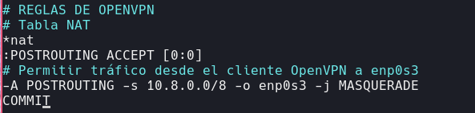


Para decirle a ufw que debe permitir paquetes redirigidos, modificamos el archivo `/etc/default/ufw`, añadiendo la línea siguiente:

```shell
DEFAULT_FORWARD_POLICY="ACCEPT"
```


Por último, añadimos las excepciones necesarias para que el firewall permita el tráfico de OpenVPN.

OpenVPN utiliza por defecto el puerto 1194 mediante udp. Tanto el puerto como el protocolo pueden modificarse en la configuración, pero nosotros no lo hemos hecho, así que ejecutamos lo siguiente:


Si OpenSSH no estuviese ya listado por ufw, sería necesario añadirlo también. Reiniciamos el servicio y todo estaría listo, al menos en esta parte.


### Iniciar y habilitar el servicio OpenVPN

Para iniciar el servicio OpenVPN e indicarle que nuestra configuración se halla en el arhivo `server.conf`, ejecutamos `sudo systemctl start openvpn@server`. Después, comprobamos su estado:

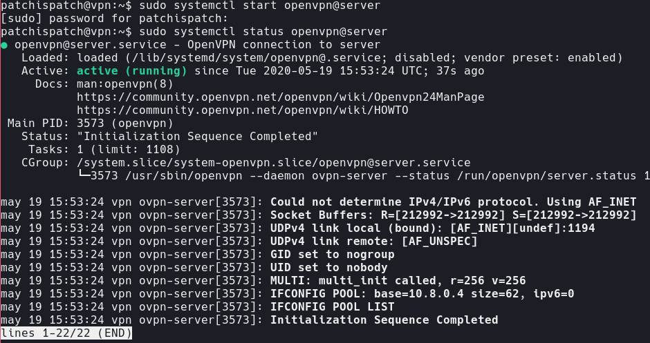

Para que arranque al iniciar, ejecutamos `sudo systemctl enable openvpn@server`.

Podemos comprobar que se ha creado la interfaz de red de VPN `tun0`:

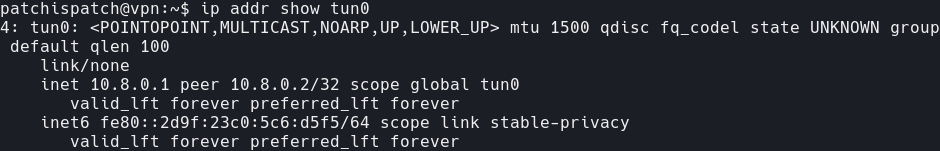


### Creación de la infraestructura de la configuración de clientes

La VPN está lista, pero necesitamos configurar los clientes. Dado que cada cliente necesita su configuración personal, vamos a crear una infraestructura para que generar y almacenar las diferentes configuraciones de usuario.

Para empezar, creamos la carpeta `~/client-configs/files`.  Después, copiamos dentro una copia del archivo de configuración de ejemplo proporcionado por OpenVPN, que nos servirá como base.

```shell
cp /usr/share/doc/openvpn/examples/sample-config-files/client.conf ~/client-configs/base.conf
```

Debemos indicar la IP de nuestro servidor OpenVPN, además del puerto, en la directiva `remote`.


Debemos confirmar también que el protocolo seleccionado es UDP, ya que tiene que coincidir con el utilizado por el servidor.


De nuevo, descomentamos los campos de usuario y grupo:


Y también los campos de los certificados:

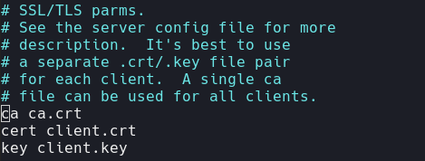


Debemos cambiar la configuración de cifrado tal y como la tenemos en `/etc/openvpn/server.conf`

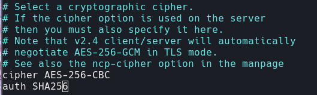


Para que la VPN funcione correctamente en el cliente debemos añadir la directiva `key-direction 1`. Además, vamos a añadir líneas comentadas que puede que necesitemos en los clientes de forma específica.

Este primer bloque de instrucciones es para aquellos clientes que **no** utilizan `systemd-resolve` para la gestión de DNS:

```
; script-security 2
; up /etc/openvpn/update-resolv-conf
; down /etc/openvpn/update-resolv-conf
```

Este es para los que sí lo utilizan:

```
; script-security 2
; up /etc/openvpn/update-systemd-resolved
; down /etc/openvpn/update-systemd-resolved
; down-pre
; dhcp-option DOMAIN-ROUTE .
```


Ahora prepararemos un script que automatice la generación de configuracion junto con las claves necesarias, y lo sitúe todo en la carpeta `client-configs/files`. Abrimos el editor y creamos el script `make_config.sh` en la carpeta `client-configs`:


Este script realizará una copia de la configuración base, recogerá los certificados y claves generadas añadiéndolas a la configuración y las colocará en el directorio correspondiente. No obstante, cada vez que se añada un cliente se deberá generar y firmar los certificados correspondientes, algo que vamos a hacer a continuación.


### Generación de configuración de clientes

Como tenemos los certificados generados para un cliente llamado `client1` de un paso anterior, ejecutamos el script. Nos generará un archivo en la carpeta `files`, llamado `client1.ovpn`. Este archivo contiene la configuración y será instalado en el cliente.


Debemos transferir este archivo al cliente. Se ha creado una nueva máquina virtual con Ubuntu 18.04 para hacer de cliente de pruebas, llamada `client` y con IP estática `192.168.56.108`. 

Realizamos la transferencia mediante `scp`, aunque dependiendo del sistema del cliente tendremos que usar diferentes métodos (cubriremos eso ahora después), y una vez finalizada tendremos el archivo listo en en la carpeta home de nuestro cliente.

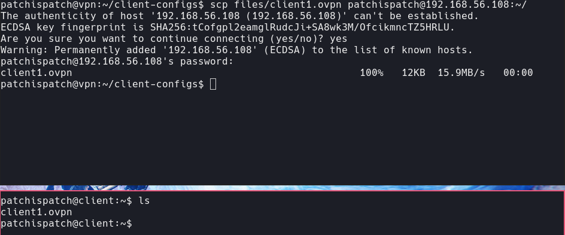


### Instalación de la configuración del cliente

Dependiendo de las características del cliente, deberemos utilizar diferentes métodos. En este caso realizaremos las pruebas en Linux.

#### Linux

En Linux, la forma más sencilla y global de configurar el cliente es utilizar el software de OpenVPN. Instalamos con `sudo apt install openvpn`, como hicimos al principio.

Debemos comprobar si nuestro cliente utiliza `systemd-resolved`. Para ello, comprobamos el archivo `/etc/resolv.conf`:

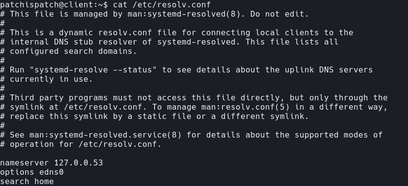

Como la dirección IP que aparece es `127.0.0.53`, sabemos que nuestro cliente está utilizando `systemd-resolved`. Para dar soporte a este tipo de clientes, debemos instalar el paquete `openvpn-systemd-resolved`. De esta forma se forzará al servicio a utilizar la conexión VPN al enviar las resoluciones y consultas DNS.

Ahora debemos abrir el archivo de configuración del cliente y descomentar las líneas que añadimos anteriormente correspondientes a systemd-resolved:

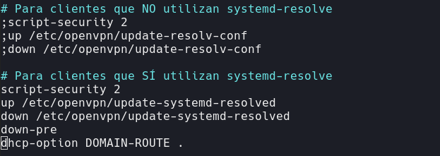


Una vez hecho esto, podemos conectarnos ejecutando `openvpn` indicando el fichero de configuración.

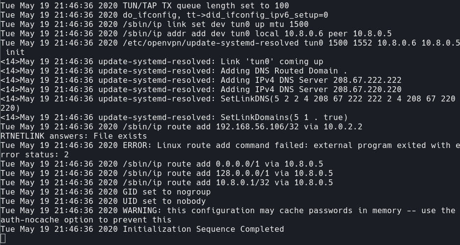


### Comprobar que todo funciona

Para comprobar que todo funciona, simplemente debemos consultar nuestra IP pública. Nosotros utilizaremos `dig` para ello. Sin conectarnos al servidor VPN desde el cliente, realizamos una petición:

> Probar desde una IP pública que no sea la misma

